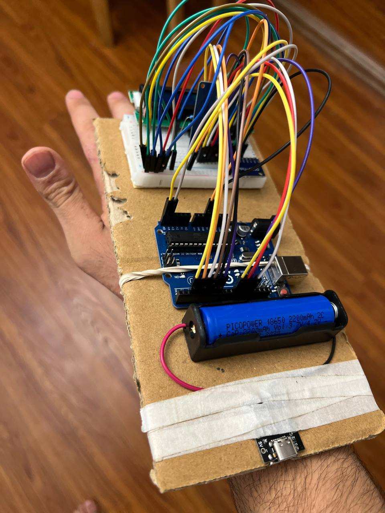
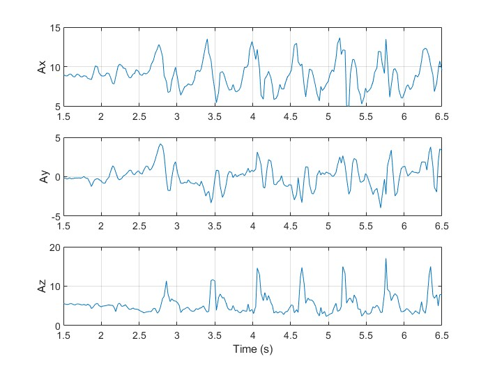
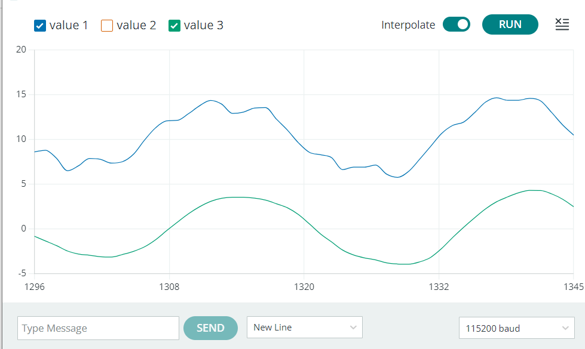
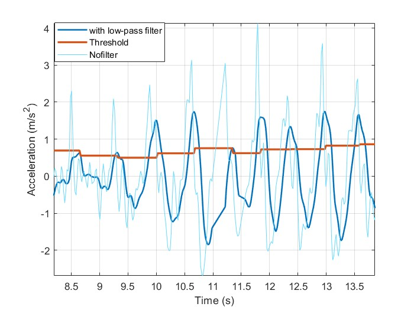
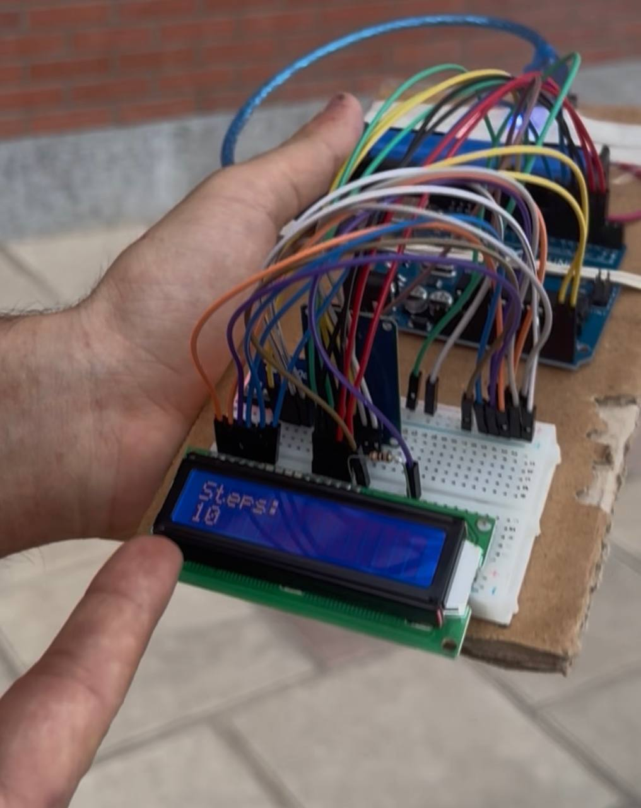
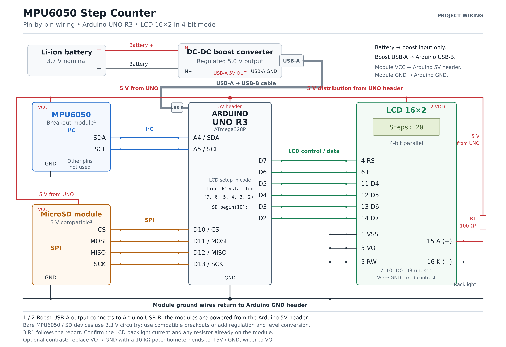

# MPU6050-Based Step Counter

  

## Overview

This project presents the design and implementation of a wearable step counter system based on an **Arduino UNO R3** and an **MPU6050 inertial measurement unit (IMU)**.

The system detects human walking steps by analyzing acceleration data obtained from the MPU6050 sensor. Raw motion signals are processed using digital filtering and threshold-based step detection algorithms, and the detected step count is displayed on a 16×2 LCD module.

The project focuses on practical implementation of an embedded motion sensing system, including hardware integration, sensor data acquisition, signal processing, and experimental validation.

---

# System Features

- Real-time step detection
- 3-axis acceleration measurement using MPU6050
- Digital signal filtering for noise reduction
- Adaptive threshold-based detection algorithm
- LCD-based step count display
- Battery-powered portable prototype
- Embedded implementation using Arduino platform

---

# Hardware Components

| Component | Description |
|---|---|
| Microcontroller | Arduino UNO R3 |
| Motion Sensor | MPU6050 Accelerometer & Gyroscope |
| Display | 16×2 LCD |
| Power Source | 3.7 V Li-ion Battery |
| Power Regulation | DC-DC Boost Converter |
| Development Platform | Arduino IDE |

---

# System Architecture

The overall system consists of three main stages:

## 1. Motion Data Acquisition

The MPU6050 sensor measures acceleration along three axes:

- X-axis acceleration
- Y-axis acceleration
- Z-axis acceleration

The sensor communicates with the Arduino through the I²C interface.

  

---

## 2. Signal Processing

Raw acceleration signals contain motion noise and high-frequency disturbances.

A filtering stage is applied to improve signal quality before step detection.

The processed acceleration signal is evaluated using a threshold-based detection method.

  

---

## 3. Step Detection Algorithm

The step detection algorithm identifies walking patterns by detecting significant acceleration variations.

The main processing steps are:

1. Read acceleration data from MPU6050  
2. Calculate motion magnitude  
3. Apply filtering  
4. Compare signal with adaptive threshold  
5. Detect valid peaks  
6. Increment step counter  

  

---

# Prototype Development

The prototype was assembled on a breadboard and integrated with:

- Arduino UNO controller
- MPU6050 sensor module
- LCD display
- Battery power system

## Hardware Prototype

  

## Wiring Overview

  

---

# Experimental Results

The developed system was tested using real motion data during walking.

The measured acceleration signals demonstrate clear periodic patterns corresponding to human steps.

The filtering algorithm improves the signal quality and enables reliable step detection.

---

# Video Demonstration

A demonstration video of the working prototype is available below:

[▶ Watch Project Demonstration](https://drive.google.com/file/d/1lsXsk7-6512XDgkxANHcplE4R8M0C8Od/view?usp=sharing)

---

# Technical Report

The complete technical report including:

- System design
- Hardware implementation
- Signal processing method
- Experimental results

is available here:

[Project Report](Report/MPU6050_Step_Counter_Project.pdf)

---

# Tools & Technologies

## Hardware

- Arduino UNO R3
- MPU6050 IMU
- LCD 16×2
- Li-ion battery system

## Software

- Arduino IDE
- MATLAB (Signal analysis and visualization)

## Concepts

- Embedded Systems
- Sensor Fusion
- Signal Processing
- Human Motion Analysis
- IoT Prototyping

---

# Project Skills Demonstrated

- Embedded system development
- Microcontroller programming
- IMU sensor integration
- Digital signal processing
- Data visualization
- Hardware prototyping
- Experimental testing

---

# Author

**Nima Nouri**

Mechanical Engineering Student  
Sharif University of Technology

Interested in:

- Robotics and Mechatronics
- Intelligent Control Systems
- Embedded Systems
- Renewable Energy Systems
